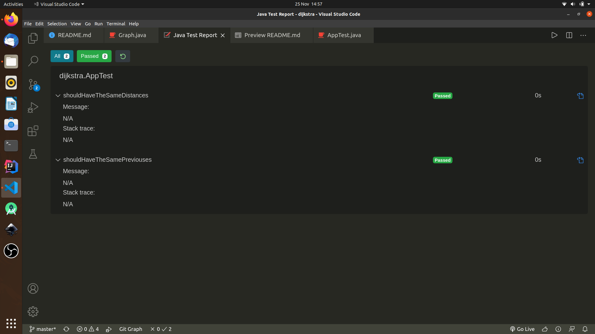

# Dijkstra

  

+ Definition:

> This is a simple implementation of the famous Dijkstra. It contains a simple test example that I get from [wikipidea](https://en.wikipedia.org/wiki/Dijkstra%27s_algorithm). In fact, this implementation give you the shortest path to all the vertexes in your graph.

You find next the graph of the example I used in the test.

  

+ How to understand the result of this code:

> The result of this code is basically two HashMaps:
>> + Distances: it gives you for each vertex of you graph the minimum distance from the source.
>>+ Previouses: for each vertex of the graph, *Previouses* maps another vertex which is its last vertex visited in the path from the source before to get to this one. Yet, the source has no previous, so we give it "" .

+ Test in vscode:

+ How to use this code:

> This is a maven project; after clone the code to your local machin have to download the depencies to use JUnit for testing. Otherwise, you can just delete the file *pom.xml* and learn from the given test to implement your own main methode and print the result. Then you can delete all the *test* folder.
